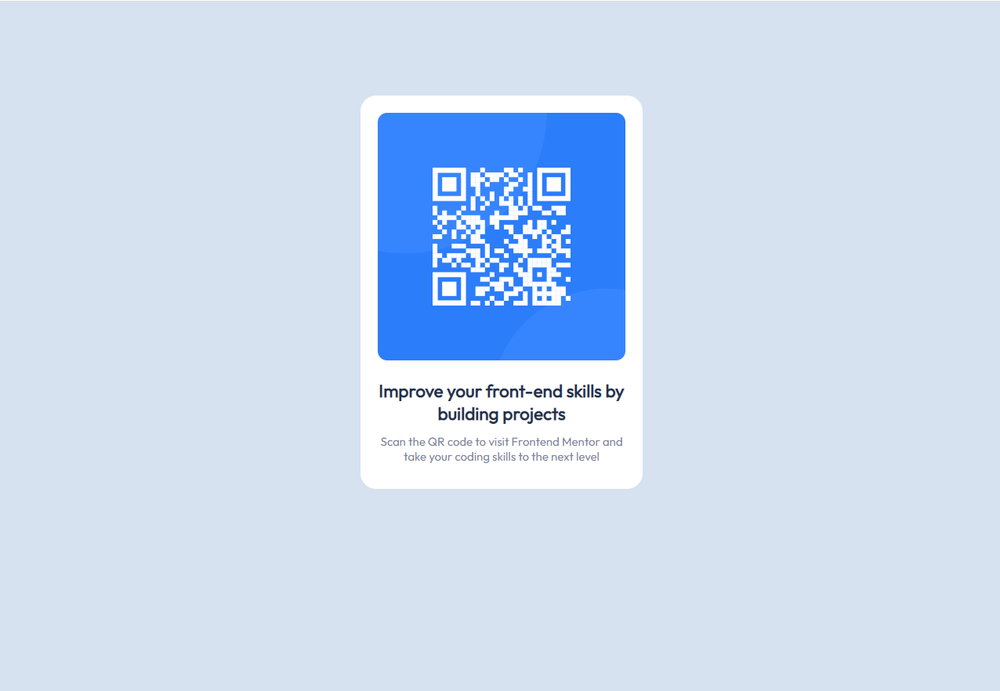

# Frontend Mentor - QR code component solution

This is a solution to the [QR code component challenge on Frontend Mentor](https://www.frontendmentor.io/challenges/qr-code-component-iux_sIO_H). Frontend Mentor challenges help you improve your coding skills by building realistic projects. 

## Table of contents

- [Overview](#overview)
  - [Screenshot](#screenshot)
  - [Links](#links)
- [My process](#my-process)
  - [Built with](#built-with)
  - [What I learned](#what-i-learned)
  - [Continued development](#continued-development)
  - [Useful resources](#useful-resources)
- [Author](#author)
- [Acknowledgments](#acknowledgments)

**Note: Delete this note and update the table of contents based on what sections you keep.**

## Overview

### Screenshot



### Links

- Live Site URL: (http://127.0.0.1:5500/index.html)

## My process
  First I built the whole HTML part, then I went to the css, I started by aligning the elements vertically and horizontally, then I put a border, colors, sizes and then I finished.

### Built with

- Semantic HTML5 markup
- CSS custom properties

### What I learned

```css
.proud-of-this-css {
  .Container {
    max-width: 360px;
    margin: 0 auto;
    padding-bottom: 50px;
    position: relative;
}

.Card {
    position: relative;
    top: 120px;
    background-color: hsl(0, 0%, 100%);
    padding: 22px;
    text-align: center;
    border-radius: 20px;
}
```

### Continued development
  Position and padding.

### Useful resources

## Author

- Frontend Mentor - [@viniciuscostafn](https://www.frontendmentor.io/profile/viniciuscostafn)

